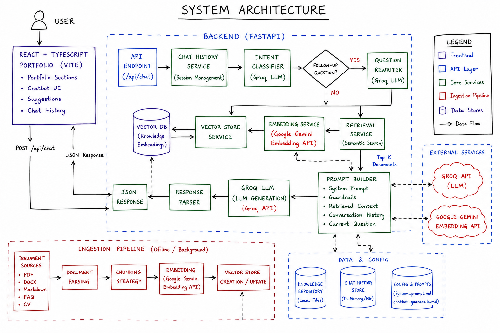
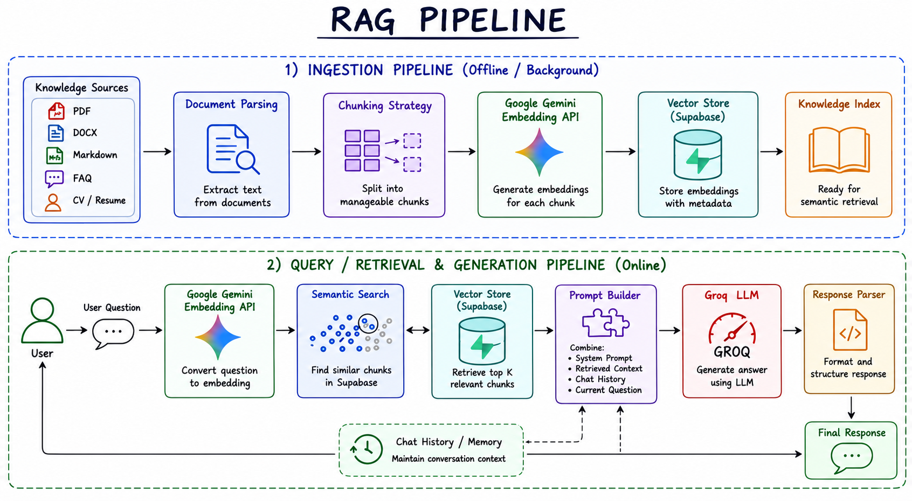
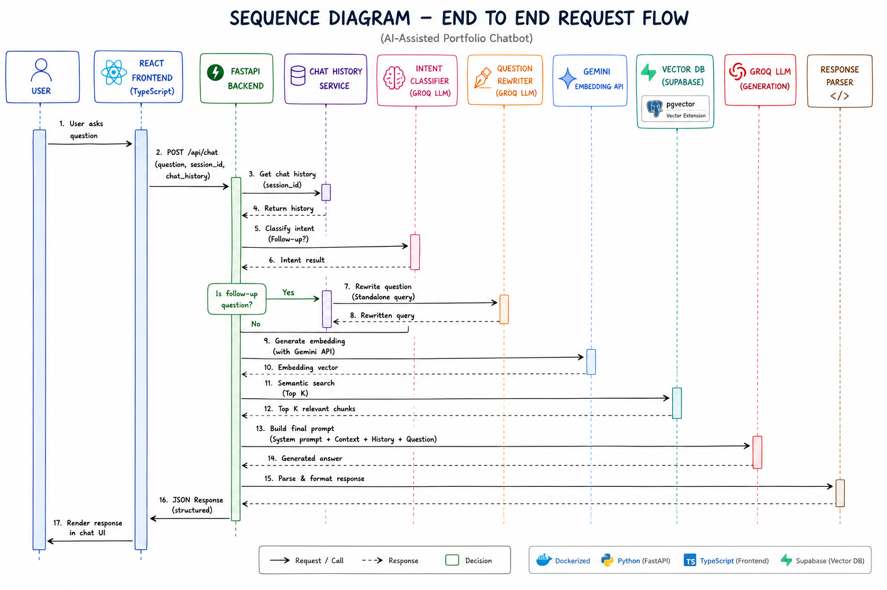

# 🤖 AI-Assisted Portfolio

An AI-powered interactive portfolio that enables visitors to explore my experience, projects, and technical skills through natural language conversations.

Instead of navigating through multiple pages, visitors can simply ask questions like:

- Tell me about your master's thesis.
- What AI projects have you built?
- Explain your backend development experience.
- What technologies have you worked with?
- What is your experience with Retrieval-Augmented Generation (RAG)?

The application combines a modern **React frontend**, a **FastAPI backend**, and a **Retrieval-Augmented Generation (RAG)** pipeline to provide context-aware, grounded, and conversational responses.

---

## 🚀 Live Demo

🔗 **Portfolio:** [https://preetihegde-portfolio.pages.dev/](https://preetihegde-portfolio.pages.dev/)

---

# 🏗️ System Architecture

<p align="center">
  
</p>

The application follows a modular Retrieval-Augmented Generation (RAG) architecture.

### High-Level Flow

1. Users interact with the chatbot through the React frontend.
2. FastAPI receives the request.
3. Chat history is loaded to preserve conversation context.
4. An Intent Classifier determines whether the question is a follow-up.
5. Follow-up questions are rewritten into standalone queries.
6. Google Gemini Embedding API converts the query into an embedding.
7. Similar documents are retrieved from Supabase Vector Database using semantic search.
8. Retrieved context is combined with:
   - System Prompt
   - Chat History
   - Current Question
9. Groq LLM generates the final answer.
10. The formatted response is returned to the frontend.

---

# 🧠 Retrieval-Augmented Generation (RAG)

<p align="center">
  
</p>

The RAG pipeline consists of two stages.

## 1. Offline Ingestion Pipeline

Knowledge sources are processed before the application starts.

```
Knowledge Sources
        │
        ▼
Document Parsing
        │
        ▼
Chunking Strategy
        │
        ▼
Google Gemini Embedding API
        │
        ▼
Supabase Vector Database
        │
        ▼
Knowledge Index
```

Supported knowledge sources include:

- Resume
- Projects
- Experience
- Skills
- Master's Thesis
- FAQs
- Markdown Files
- PDFs
- DOCX Files

---

## 2. Online Retrieval Pipeline

```
User Question
        │
        ▼
Gemini Embedding API
        │
        ▼
Semantic Search
        │
        ▼
Supabase Vector Database
        │
        ▼
Top-K Relevant Chunks
        │
        ▼
Prompt Builder
        │
        ▼
Groq LLM
        │
        ▼
Formatted Response
```

---

# 🔄 End-to-End Request Flow

<p align="center">
  
</p>

### Request Lifecycle

1. User submits a question.
2. Frontend sends the request to FastAPI.
3. Chat history is retrieved.
4. Intent classifier checks whether the query is a follow-up.
5. Follow-up questions are rewritten into standalone queries.
6. Google Gemini Embedding API generates query embeddings.
7. Similar documents are retrieved from Supabase using vector similarity search.
8. Retrieved context is combined with conversation history.
9. Groq generates the final answer.
10. The response is formatted and returned to the frontend.

---

# ✨ Features

- 🤖 AI-powered portfolio assistant
- 📚 Retrieval-Augmented Generation (RAG)
- 💬 Conversational chat interface
- 🔍 Semantic Search
- 🧠 Follow-up question understanding
- ✍️ Automatic question rewriting
- 📄 Markdown response rendering
- 💾 Chat history management
- 📱 Responsive user interface

---

# 🛠️ Tech Stack

## Frontend

- React
- TypeScript
- Vite
- Tailwind CSS

---

## Backend

- Python
- FastAPI

---

## AI Stack

| Component | Technology |
|------------|------------|
| LLM | Groq API |
| Embedding Model | Google Gemini Embedding API |
| Retrieval | Semantic Search |
| Prompt Engineering | Custom Prompt Templates |
| Chat Memory | Session-based Conversation History |

---

## Data Layer

| Component | Technology |
|------------|------------|
| Vector Database | Supabase (pgvector) |
| Knowledge Repository | Markdown, PDF, DOCX |

---

# 📂 Project Structure

```text
AI-Assisted-Portfolio
│
├── backend
│   ├── api
│   ├── prompts
│   ├── services
│   ├── utils
│   ├── knowledge_repository
│   ├── app.py
│   └── requirements.txt
│
├── frontend
│   ├── src
│   ├── public
│   └── package.json
│
├── docs
│   ├── system-architecture.png
│   ├── rag-pipeline.png
│   └── sequence-diagram.png
│
├── README.md
└── LICENSE
```

---

# ⚙️ Installation

## Clone Repository

```bash
git clone https://github.com/preetihegde/ai-assisted-portfolio.git

cd ai-assisted-portfolio
```

---

## Backend

```bash
cd backend

python -m venv venv

source venv/bin/activate

# Windows
venv\Scripts\activate

pip install -r requirements.txt

uvicorn app:app --reload
```

---

## Frontend

```bash
cd frontend

npm install

npm run dev
```

---

# 🔐 Environment Variables

Create a `.env` file inside the backend directory.

```env
GOOGLE_API_KEY=your_google_api_key

GROQ_API_KEY=your_groq_api_key

SUPABASE_URL=your_supabase_url

SUPABASE_KEY=your_supabase_key
```

---

# 🚀 Future Improvements

- Hybrid Search (Keyword + Semantic)
- Retrieval Reranking
- Streaming Responses
- Persistent Chat Sessions
- Authentication
- Conversation Analytics
- Multi-language Support
- Evaluation Pipeline
- Feedback Collection

---

# 🎯 Why Retrieval-Augmented Generation?

Traditional LLMs rely solely on pre-trained knowledge, which may become outdated or hallucinate information.

This portfolio uses **Retrieval-Augmented Generation (RAG)** to ground responses in my own documents and experiences.

Benefits include:

- More accurate responses
- Reduced hallucinations
- Up-to-date portfolio information
- Explainable answers based on retrieved context
- Better handling of technical questions

---

# 👩‍💻 Author

**Preeti Hegde**

AI Engineer | Software Engineer

**Interests**

- Generative AI
- Retrieval-Augmented Generation (RAG)
- Backend Development
- FastAPI
- Python
- Java
- Computer Vision
- LLM Applications

---

# 📄 License

This project is licensed under the MIT License.

---

⭐ If you found this project interesting, consider giving it a star!